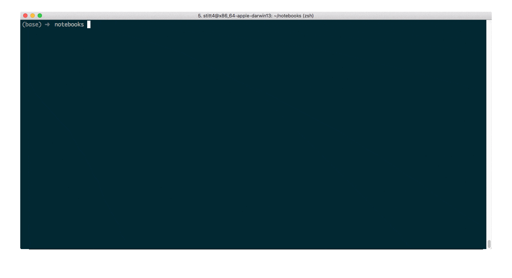

# Notebook Connect Existing

Jupyter Notebook tree (front page) extension that lets you connect to existing kernels.



## Install

```shell
pip install .
```

## Helpful links

[Distributing Jupyter Extensions as Python Packages - Server Extension](https://jupyter-notebook.readthedocs.io/en/stable/examples/Notebook/Distributing%20Jupyter%20Extensions%20as%20Python%20Packages.html#Example---Server-extension)

[Custom request handlers - Writing a notebook server extension](https://jupyter-notebook.readthedocs.io/en/stable/extending/handlers.html#writing-a-notebook-server-extension)
